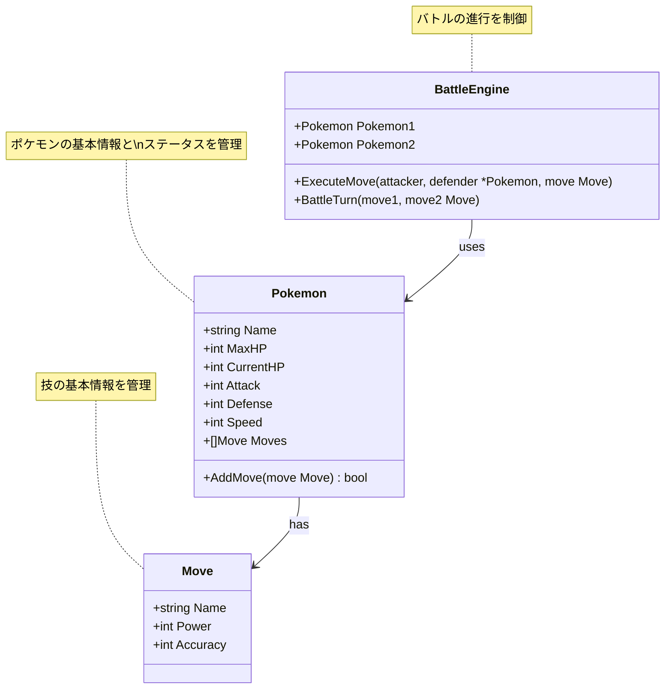

```mermaid
classDiagram
    class Pokemon {
        +string Name
        +int MaxHP
        +int CurrentHP
        +int Attack
        +int Defense
        +int Speed
        +[]Move Moves
        +AddMove(move Move) bool
    }

    class Move {
        +string Name
        +int Power
        +int Accuracy
    }

    class BattleEngine {
        +Pokemon Pokemon1
        +Pokemon Pokemon2
        +ExecuteMove(attacker, defender *Pokemon, move Move)
        +BattleTurn(move1, move2 Move)
    }

    BattleEngine --> Pokemon : uses
    Pokemon --> Move : has

    note for Pokemon "ポケモンの基本情報と\nステータスを管理"
    note for Move "技の基本情報を管理"
    note for BattleEngine "バトルの進行を制御" 
```